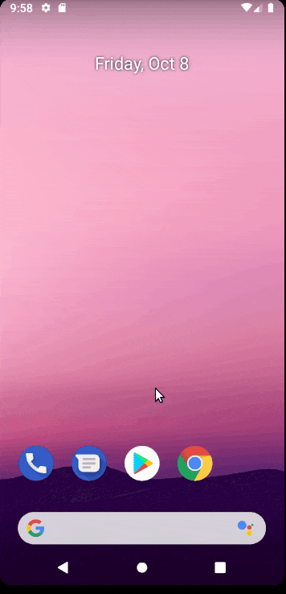

# Project 2 - *BirdInTheHand*

**BirdInTheHand** is an android app that allows a user to view his Twitter timeline and post a new tweet. The app utilizes [Twitter REST API](https://dev.twitter.com/rest/public).

Time spent: **8** hours spent in total

## User Stories

The following **required** functionality is completed:

- [x] User can **compose and post a new tweet**
  - [x] User can click a “Compose” icon in the Action Bar on the top right
  - [x] User can then enter a new tweet and post this to twitter
  - [x] User is taken back to home timeline with **new tweet visible** in timeline
  - [x] Newly created tweet should be manually inserted into the timeline and not rely on a full refresh
  - [x] User can **see a counter with total number of characters left for tweet** on compose tweet page

The following **optional** features are implemented:

- [x] User is using **"Twitter branded" colors and styles**
- [x] User can click links in tweets launch the web browser 
- [x] User can **select "reply" from detail view to respond to a tweet**
- [ ] The "Compose" action is moved to a FloatingActionButton instead of on the AppBar
- [ ] Compose tweet functionality is build using modal overlay
- [x] Use Parcelable instead of Serializable using the popular [Parceler library](http://guides.codepath.org/android/Using-Parceler).
- [ ] User can **open the twitter app offline and see last loaded tweets**. Persisted in SQLite tweets are refreshed on every application launch. While "live data" is displayed when app can get it from Twitter API, it is also saved for use in offline mode.
- [ ] When a user leaves the compose view without publishing and there is existing text, prompt to save or delete the draft. If saved, the draft should then be **persisted to disk** and can later be resumed from the compose view.
- [ ] Enable your app to receive implicit intents from other apps. When a link is shared from a web browser, it should pre-fill the text and title of the web page when composing a tweet. 

The following **additional** features are implemented:

- [ ] List anything else that you can get done to improve the app functionality!

## Video Walkthrough

Here's a walkthrough of implemented user stories:

GIF created with [Peek](https://github.com/phw/peek).

## Notes

Challenges: Core/required stories where completed realatively easily and quickly since I had much more knowledge from working with the Twitter API last week. Majority of the challenge came from trying to the implement the reply action from the detailed view. I started by creating a brand new activity but realised I could utilize the exsisting ComposeActivity to send replies, so it was challenging using a single Activity i.e. ComposeActivity, to handle both send a new tweet and replying to a tweet.

## Open-source libraries used

- [Android Async HTTP](https://github.com/codepath/CPAsyncHttpClient) - Simple asynchronous HTTP requests with JSON parsing
- [Glide](https://github.com/bumptech/glide) - Image loading and caching library for Android

## License

    Copyright 2021 Jules B.

    Licensed under the Apache License, Version 2.0 (the "License");
    you may not use this file except in compliance with the License.
    You may obtain a copy of the License at

        http://www.apache.org/licenses/LICENSE-2.0

    Unless required by applicable law or agreed to in writing, software
    distributed under the License is distributed on an "AS IS" BASIS,
    WITHOUT WARRANTIES OR CONDITIONS OF ANY KIND, either express or implied.
    See the License for the specific language governing permissions and
    limitations under the License.
